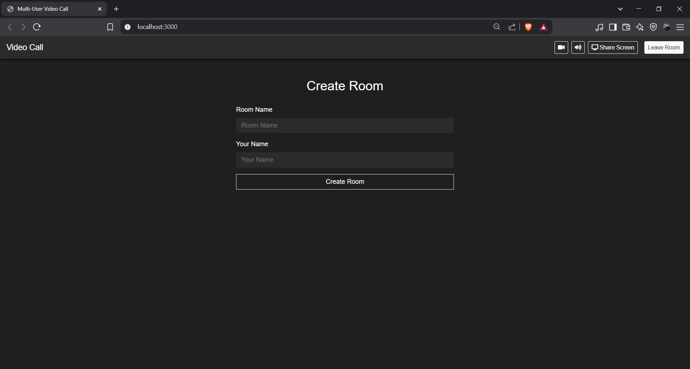
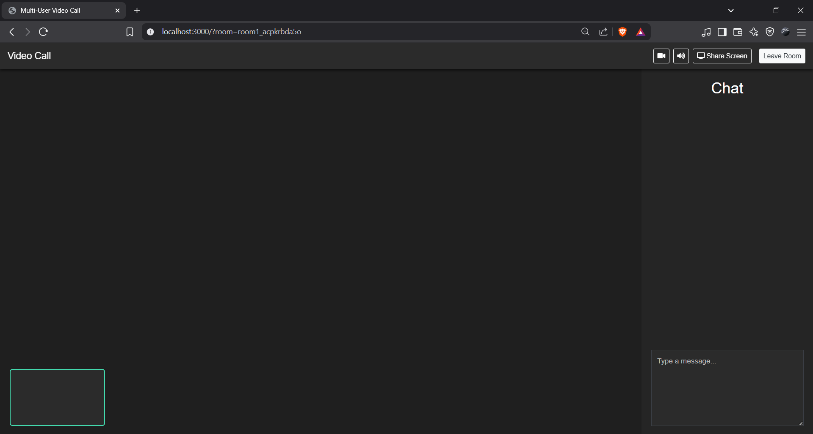
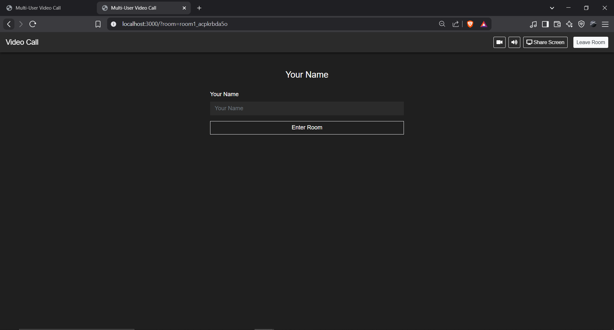
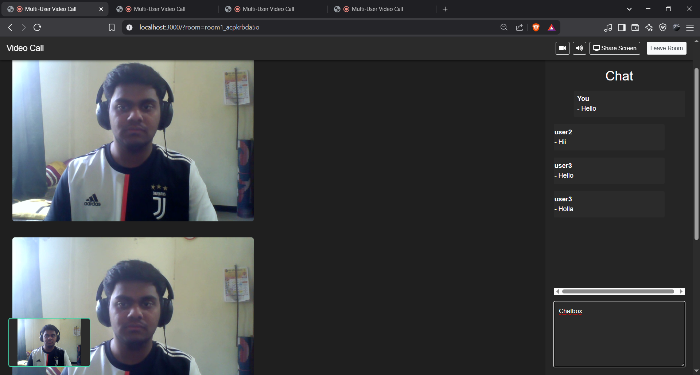
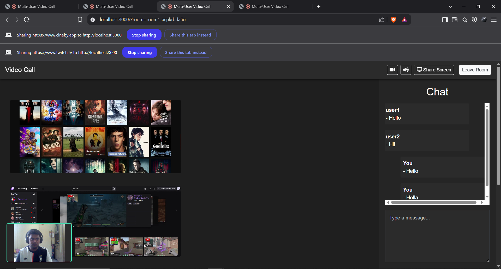
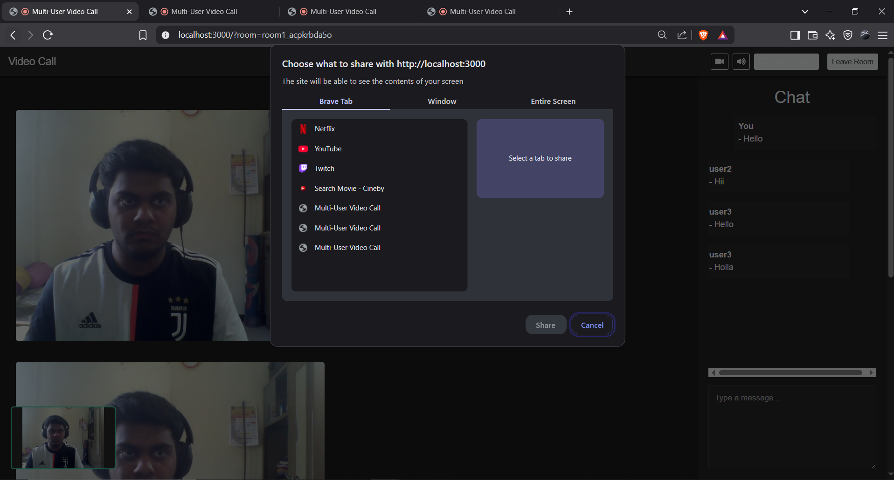

# EchoMeet
A full-featured multi-user video conferencing app with real-time text chat and screen sharing, built from scratch using WebRTC, Socket.io, and vanilla JavaScript.
---

## Overview
EchoMeet allows multiple users to join a “room” via a unique URL, see and hear each other peer-to-peer via WebRTC, exchange real-time text messages, and share their screens. No third-party video services—just open browser tabs, share links, and start collaborating instantly!

---
## Project map
1. **HTML & layout**
  - I built index.html with Bootstrap 4 and Font Awesome, defining three hidden sections (Create Room, Set Username, Video & Chat.
2. **UI logic**
  - In events.js I handle “Create/Enter Room” clicks, store the username in sessionStorage, and toggle picture-in-picture on your video.
3. **Helper functions**
  - The helpers.js parses URL params, generates room IDs, checks for media availability, updates chat messages, and shows a “New” badge when chat is collapsed.
4. **WebRTC signaling**
  - Connected to Socket.io’s /stream namespace, kept a map of RTCPeerConnection objects, exchanged SDP offers/answers and ICE candidates, and injected or removed remote video elements on the fly.
5. **Chat & controls**
  - Built real-time text chat (hit Enter to send, side-by-side messages), plus camera/mic toggle buttons that automatically swap icons.
6. **Screen share & styling**
  - Used getDisplayMedia() for screen sharing with a Share/Stop toggle, then styled everything in a dark, responsive layout via app.css
---

## Features
- **Room Creation & Joining** via a unique URL  
- **Multi-party Video & Audio** using WebRTC mesh topology  
- **Real-Time Text Chat** alongside video streams  
- **Mute/Unmute** camera & microphone controls  
- **Picture-in-Picture** mode for local video  
- **Screen Sharing** with seamless start/stop  
- **Responsive Dark-themed UI**  
---

## Tech Stack
- **Frontend**  
  - HTML5, CSS3 (Bootstrap 4.4)  
  - Vanilla JavaScript  
  - Font Awesome icons

- **Real-Time & Media**  
  - WebRTC (RTCPeerConnection, getUserMedia, getDisplayMedia)  
  - Socket.io for signaling  
  - webrtc-adapter

- **Backend**  
  - Node.js & Express (serving static files + Socket.io server)
---

## Screenshots
**Create a New Room**  


**Host Window (no peers yet)**  


**Username Prompt for New Joiners**  


**Active Video Chat with Multiple Peers**  


**Multiple Participants Sharing Screens**  


**Browser Screen-Share Picker**  


---

## Getting Started

### Prerequisites

- **Node.js** v14 or higher  
- **npm** (bundled with Node.js)

### Installation

```bash
git clone https://github.com/abhishekbankar28/EchoMeet.git
cd EchoMeet
npm install
---
